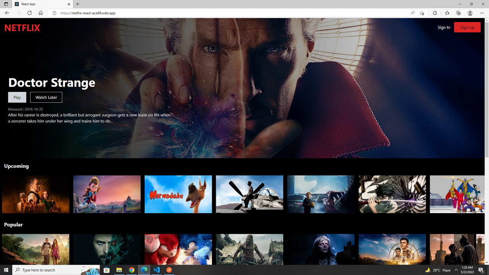

# Netflix with React JS - Tailwind CSS - FIREBASE   
    
  

### Live Link - https://netflix-react-aca99.web.app/

 

I used React, React Router, Axios, Tailwind Css, Firebase, React Icons to build the project  .
 
### Api Link
 Popular: `https://api.themoviedb.org/3/movie/popular?api_key=${key}&language=en-US&page=1`, 
    TopRated: `https://api.themoviedb.org/3/movie/top_rated?api_key=${key}&language=en-US&page=1`, 
    Trending: `https://api.themoviedb.org/3/movie/popular?api_key=${key}&language=en-US&page=2`, 
    Horror: `https://api.themoviedb.org/3/search/movie?api_key=${key}&language=en-US&query=horror&page=1&include_adult=false`, 
    Upcoming: `https://api.themoviedb.org/3/movie/upcoming?api_key=${key}&language=en-US&page=1`, 

### Env Variables 
REACT_APP_FIREBASE_API_KEY=
 
REACT_APP_FIREBASE_AUTH_DOMAIN= 
REACT_APP_FIREBASE_PROJECT_ID= 
REACT_APP_FIREBASE_STORAGE_BUCKET= 
REACT_APP_MESSAGING_SENDER= 
REACT_APP_APP_ID= 

### Author Links  

👋 Hello,I am Shadman and I am a Full Stack Web developer  

🚀 Follow me:  

  - [Github](https://github.com/sakibshadman19)
  - [LinkedIn](https://www.linkedin.com/in/shadmansakib1/)

  

<!-- all link is here -->

